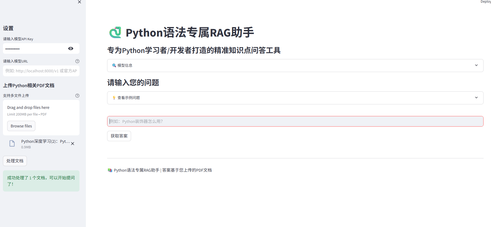

# Python学习RAG助手 🐍

<div align="center">
  
  
  
  
  
  
</div>

## 🎯 项目简介

**Python学习RAG助手**是一个专为Python初学者设计的智能学习工具，同时也是一个**初级RAG（检索增强生成）技术实践项目**。这个项目以简洁明了的方式实现了RAG的核心流程，非常适合AI和Python学习者入门了解检索增强生成技术的基本原理和实现方法。

### 🌟 项目定位

这是一个**入门级RAG实践项目**，我们精心简化了复杂的技术细节，重点展示了RAG技术的核心工作流程，包括文档处理、文本分块、向量存储、相似度检索和智能问答等关键环节。通过学习和实践这个项目，您将能够：

- 理解RAG技术的基本概念和工作原理
- 掌握如何使用Python实现一个简单的RAG系统
- 学习向量数据库（FAISS）的基本使用方法
- 了解如何集成大语言模型（如Qwen）进行智能问答
- 熟悉Streamlit构建交互式Web界面的基本技能


## 🛠️ 使用指南

### 1. 准备工作
- 获取Qwen API Key（可从阿里云通义千问平台获取）
- 下载本地嵌入模型（all-MiniLM-L6-v2），不会科学上网可从网站直接下载https://public.ukp.informatik.tu-darmstadt.de/reimers/sentence-transformers/v0.2/
- 准备Python相关的PDF文档

### 2. 配置与使用

1. .env文件中配置您的Qwen API Key和LOCAL_EMBEDDING_MODEL_PATH
2. 上传准备好的Python相关PDF文档
3. 点击"处理文档"按钮，等待文档处理完成
4. 在主界面输入您的问题（例如："Python装饰器怎么用？"）
5. 点击"获取答案"按钮，查看AI生成的回答和知识来源

### 3. 示例问题

- Python 装饰器怎么用？
- 列表推导式和生成器表达式的区别是什么？
- 如何高效处理大型文件？
- Python中的GIL是什么？它有什么影响？

## 🔍 技术原理

### RAG（检索增强生成）工作流程

RAG技术是一种结合了检索和生成的AI技术，能够基于特定文档内容生成准确的回答。以下是本项目中RAG的工作流程，适合初学者理解：

1. **文档摄入阶段**
   - 首先，系统从上传的PDF文档中提取文本内容
   - 将文本分割成大小适中的"文本块"，便于后续处理
   - 使用嵌入模型（sentence-transformers）将每个文本块转换为向量表示
   - 将这些向量存储到向量数据库（FAISS）中，建立索引

2. **用户查询阶段**
   - 用户输入问题
   - 系统将问题转换为向量表示
   - 在向量数据库中检索与问题最相关的文本块
   - 将检索到的相关文本块作为上下文，与原始问题一起发送给大语言模型

3. **回答生成阶段**
   - 大语言模型结合上下文信息和问题，生成针对性的回答
   - 系统将生成的回答和相关的文档来源返回给用户

### 核心组件说明

该项目结合了以下关键组件：

1. **文档处理**：使用PyPDF2提取PDF文档内容
2. **文本分块**：使用LangChain的RecursiveCharacterTextSplitter将文本分割成合适大小的块
4. **嵌入模型**：使用嵌入模型生成文本嵌入
5. **向量存储**：使用FAISS构建高效的向量检索系统
5. **大模型集成**：集成Qwen大模型生成高质量回答
6. **用户界面**：使用Streamlit构建友好的Web界面

## 🚀 快速开始

### 1. 环境准备

```bash
# 克隆项目
git clone https://github.com/your-username/python-rag-assistant.git
cd python-rag-assistant

# 创建虚拟环境
python -m venv venv

# 激活虚拟环境
venv\Scripts\activate

# 安装依赖
pip install -r requirements.txt
```

### 2. 配置设置

```bash
# 复制环境变量模板
copy .env .env

# 编辑.env文件，填入您的配置
# 主要需要设置：
# - QWEN_API_KEY: 您的API密钥
# - LOCAL_EMBEDDING_MODEL_PATH: 本地模型路径
```

### 3. 运行应用

```bash
# 启动Web应用
打开终端，进行虚拟环境找到对应位置，输入 streamlit run python_rag_assistant.py
```

### 应用运行界面展示



## 📝 注意事项

1. 确保上传的PDF文档包含清晰、准确的Python语法知识
2. API Key是访问Qwen大模型的必要凭证，请妥善保管
3. 文档处理时间取决于文档大小和数量，请耐心等待
4. 如有问题，请查看控制台输出的日志信息

## 📚 进阶学习

完成本项目的学习后，如果您想进一步探索更复杂的RAG技术和应用，可以查看我的主页上的**进阶版RAG项目**，该项目包含更多高级功能，如多文档支持、复杂检索策略优化、fastapi接口，帮助您深入掌握RAG技术的进阶应用。

## 📄 许可证

本项目采用MIT许可证。